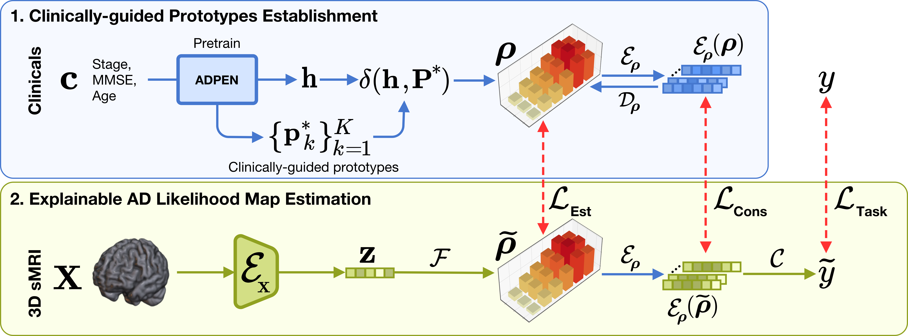

# XADLiME: eXplainable Alzheimer's Disease Likelihood Map Estimation via Clinically-guided Prototype Learning


This repository provides the PyTorch implementation of our proposed XADLiME framework in addressing Alzheimer's Disease progression modeling.

## Datasets
We utilized Alzheimer's disease neuroimaging initiative dataset
* http://www.loni.usc.edu/ADNI

## Usage
### ADPEN
For pretraining the ADPEN, run:
``` 
python xadlime_adpen.py --fold=1 --gpu_id=0 --finetune=0
```
For finetuning the ADPEN, make a list the pretrained directory location and run:
``` 
python xadlime_adpen.py --fold=1 --gpu_id=0 --finetune=1
```

### ProgAE
For training the autoencoder for progression map, run:
``` 
python xadlime_progae.py --fold=1 --gpu_id=0
```

### XADLiME
After training all required networks, XADLiME can be executed through:
``` 
python xadlime_classification_clinicalstage.py --fold=1 --gpu_id=0
```
``` 
python xadlime_regression_mmse.py --fold=1 --gpu_id=0
```
``` 
python xadlime_regression_age.py --fold=1 --gpu_id=0
```

## Citation
If you find this work useful for your research, please cite our [preprint paper](https://arxiv.org/abs/2207.13223).
```
@misc{mulyadi2022xadlime,
  doi={10.48550/ARXIV.2207.13223},
  url={https://arxiv.org/abs/2207.13223},
  author={Mulyadi, Ahmad Wisnu and Jung, Wonsik and Oh, Kwanseok and Yoon, Jee Seok and Suk, Heung-Il},
  title={XADLiME: eXplainable Alzheimer's Disease Likelihood Map Estimation via Clinically-guided Prototype Learning},
  publisher={arXiv},
  year={2022},
  copyright={arXiv.org perpetual, non-exclusive license}
}

```

## Acknowledgements
This work was supported by Institute of Information & communications Technology Planning & Evaluation (IITP) grant funded by the Korea government (MSIT) No. 2022-0-00959 ((Part 2) Few-Shot Learning of Causal Inference in Vision and Language for Decision Making) and No. 2019-0-00079 (Artificial Intelligence Graduate School Program (Korea University)).
